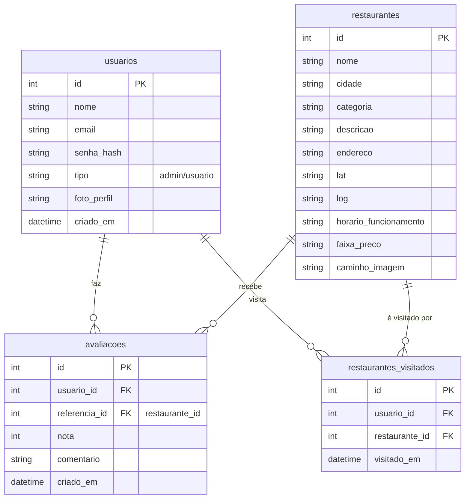

# Documentação do Sistema - Sabores do Turismo

## 1. Descrição Geral do Sistema
O **Sabores do Turismo** é uma plataforma web voltada para o turismo gastronômico no estado de Mato Grosso do Sul. O objetivo principal é conectar turistas e moradores locais aos melhores restaurantes da região, permitindo a descoberta de novos sabores, a visualização de detalhes sobre os estabelecimentos e o gerenciamento de experiências gastronômicas pessoais.

O sistema permite que usuários pesquisem restaurantes por diversos critérios (nome, cidade, culinária, preço, avaliação), visualizem informações detalhadas (incluindo mapa), marquem restaurantes que já visitaram e gerenciem seu perfil.

## 2. Requisitos Funcionais (RF)

| ID | Descrição |
|---|---|
| **RF001** | O sistema deve permitir o cadastro de novos usuários (Nome, Email, Senha). |
| **RF002** | O sistema deve permitir o login de usuários cadastrados. |
| **RF003** | O sistema deve permitir que usuários visualizem uma lista de restaurantes. |
| **RF004** | O sistema deve permitir filtrar restaurantes por nome, cidade, tipo de culinária, faixa de preço e avaliação mínima. |
| **RF005** | O sistema deve exibir detalhes completos de um restaurante (endereço, horário, descrição, mapa). |
| **RF006** | O sistema deve permitir que usuários logados marquem/desmarquem restaurantes como "Visitados". |
| **RF007** | O sistema deve permitir que o usuário visualize seu perfil com seus dados e a lista de restaurantes visitados. |
| **RF008** | O sistema deve permitir que o usuário altere sua foto de perfil (upload de imagem). |
| **RF009** | O sistema deve permitir que o usuário remova restaurantes da lista de visitados através do perfil. |
| **RF010** | O sistema deve possuir uma área administrativa para gerenciamento (CRUD) de restaurantes (Restrito a administradores). |
| **RF011** | O sistema deve permitir logout. |

## 3. Requisitos Não Funcionais (RNF)

| ID | Descrição |
|---|---|
| **RNF001** | O sistema deve ser desenvolvido utilizando PHP (Backend) e MySQL (Banco de Dados). |
| **RNF002** | A interface deve ser responsiva e amigável, utilizando Tailwind CSS. |
| **RNF003** | As senhas dos usuários devem ser armazenadas de forma criptografada (Hash). |
| **RNF004** | O sistema deve garantir a persistência da sessão do usuário por um tempo determinado. |
| **RNF005** | O upload de imagens deve ser restrito a arquivos de imagem (JPG, PNG, WEBP) e ter limite de tamanho (ex: 5MB). |

## 4. Descritivo de Testes (Casos de Teste)

Abaixo estão os casos de teste para validar as principais funcionalidades do sistema.

### 4.1. Autenticação

| ID Caso | Cenário | Passos de Execução | Dados de Entrada | Resultado Esperado |
|---|---|---|---|---|
| **CT01** | Login com Sucesso | 1. Acessar página de login. 2. Preencher email e senha corretos. 3. Clicar em "Entrar". | Email: `usuario@teste.com` Senha: `123456` | Redirecionamento para a Home/Dashboard. Sessão iniciada. |
| **CT02** | Login com Senha Inválida | 1. Acessar página de login. 2. Preencher email correto e senha errada. 3. Clicar em "Entrar". | Email: `usuario@teste.com` Senha: `errada` | Mensagem de erro "Credenciais inválidas". Permanecer na tela de login. |
| **CT03** | Cadastro de Novo Usuário | 1. Acessar página de cadastro. 2. Preencher todos os campos. 3. Clicar em "Cadastrar". | Nome: `Novo User` Email: `novo@teste.com` Senha: `123` | Mensagem de sucesso ou redirecionamento para login. Usuário criado no banco. |

### 4.2. Funcionalidades de Restaurante

| ID Caso | Cenário | Passos de Execução | Dados de Entrada | Resultado Esperado |
|---|---|---|---|---|
| **CT04** | Filtrar Restaurantes | 1. Acessar página de restaurantes. 2. Selecionar filtro de cidade. 3. Clicar em "Filtrar" (ou automático). | Cidade: `Bonito` | A lista deve exibir apenas restaurantes localizados em Bonito. |
| **CT05** | Marcar como Visitado | 1. Logar no sistema. 2. Ir para lista de restaurantes. 3. Clicar no checkbox "Visitado" no card de um restaurante. | Clique no Checkbox | O ícone deve mudar para verde (checked). O registro deve ser salvo no banco. |
| **CT06** | Desmarcar como Visitado | 1. Logar no sistema. 2. Clicar no checkbox de um restaurante já visitado. | Clique no Checkbox | O ícone deve voltar ao estado original (unchecked). O registro deve ser removido do banco. |

### 4.3. Perfil do Usuário

| ID Caso | Cenário | Passos de Execução | Dados de Entrada | Resultado Esperado |
|---|---|---|---|---|
| **CT07** | Visualizar Perfil | 1. Logar no sistema. 2. Clicar no menu "Meu Perfil". | N/A | Exibir dados do usuário (Nome, Email) e lista de restaurantes visitados. |
| **CT08** | Upload de Foto de Perfil | 1. Acessar perfil. 2. Clicar na foto de perfil. 3. Selecionar arquivo de imagem válido. | Arquivo: `foto.jpg` | A imagem deve ser enviada e atualizada na tela imediatamente. |
| **CT09** | Upload de Arquivo Inválido | 1. Acessar perfil. 2. Clicar na foto. 3. Selecionar arquivo não imagem (ex: .pdf). | Arquivo: `doc.pdf` | Mensagem de erro informando formato inválido. Imagem não deve ser alterada. |
| **CT10** | Remover Visita pelo Perfil | 1. Acessar perfil. 2. Localizar restaurante na tabela. 3. Clicar no ícone de lixeira. 4. Confirmar alerta. | Clique em "Remover" | O restaurante deve sumir da lista. |

## 5. Diagrama de Entidade e Relacionamento (DER)

Representação da estrutura do banco de dados `saboresdoturismo`.

